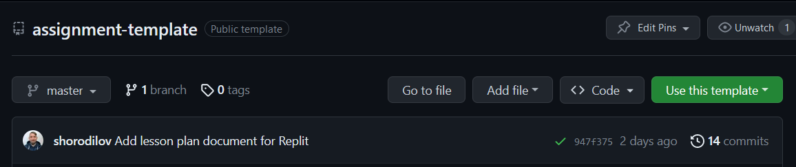
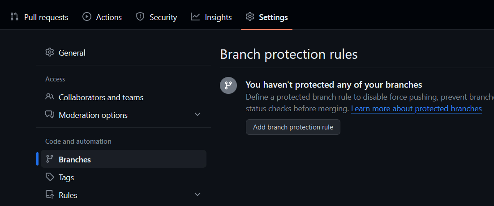
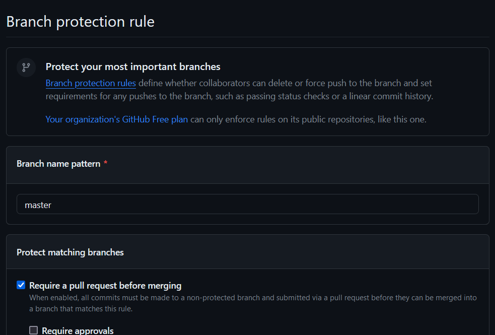
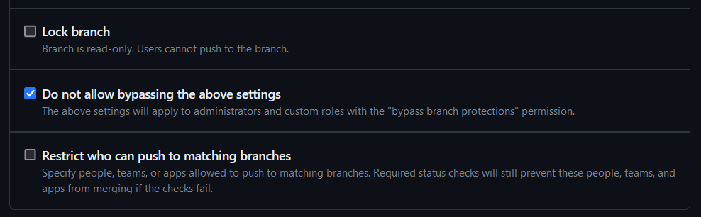
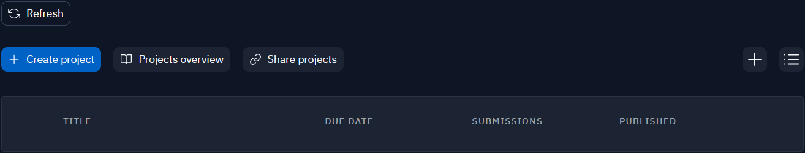
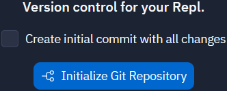

# Assignment: ASSIGNMENT NAME

This repository is compatible with [Replit](https://replit.com/).

[//]: # (TODO: provide a short assignment overview)
Assigment overview goes here... TBD

## Getting started

### Creating a new repository from template

Press the `Use this template` green button at the top.



This will lead you to the repository creation page.
Provide a valid meaningful repo name and add its description.

There is no need to clone branches except `master`. Default branch is always at
the most stable version.

### Protect master branch

It's important not to work within the default branch. So, ensure noone can
commit directly into `master`. In **Settings** navigate to **Branches** under
the **Code and automation** section. Press `Add branch protection rule` button.



Provide branch name pattern and check following options:

- **Require a pull request before merging**
- **Require status checks to pass before merging**
    - **Require branches to be up date before merging**
- **Do not allow bypassing the above settings**





This will protect the default branch from committing directly into it.
You may apply other protection rules, in case of need.

Create a branch protection rule.

## Materials within this repo

There are few major files here.

- `main.py` is the main code base file. It will be used to complete
  the assignment by students.
- `tests` directory is the home of **all** tests provided for the assignment.
- `.lesson` directory is the documentation source
    - `.lesson/instructions.md` is the assignment instructions file visible for
      all.
    - `.lesson/lessonplan.md` is the private file, available only for
      the assignment owners and/or admins.

Other documents may be included into `.lesson` directory.
Only `instructions.md` will be visible for the students.

## Getting started

1. Clone your assignment repo to your local machine.
2. Create a new topic branch (e.g. `feature/assignment`).
3. Complete the assignment instructions. Provide a clear objective and usage
   examples.
4. Prepare the code boilerplate file (`main.py`).
5. Add test cases (use `unittest` framework only).

### Make your boilerplate file invisible for Git

When a boilerplate code is ready, you may want to implement the actual logic
for the assignment. It's useful for running tests especially. However, you do
not want to put the implementation to the assignment repository.

To make changes inside a file invisible for Git use:

```shell
git update-index --assume-unchanged <file>
```

To switch it back:

```shell
git update-index --no-assume-unchanged <file>
```

Always do this while working with non-boilerplate code inside `main.py`.

### Testing

Assignment follows TDD approach. This means all the tests should fail.
Decorate your test cases with `unittest.expectedFailure`. Otherwise, it
will be impossible to merge topic branch into `master.`

## Add the assignment to Replit

There is no way to import GitHub repo as lesson project to Replit. So, it's
a little bit tricky to connect the Replit project with a GitHub repository.

Navigate to EDU organization's team and press `Create project` button.



Provide all the information about the assignment.


There is an [assignments library](https://replit.com/@assignments-library)
of current course available on Replit. For the assignments within this team,
there is no need to set a **due date**. Assignments will be copied to other
working teams from here.

In the repl, first press `Add lesson contents` button. Replit does not remove
it, until it hasn't been clicked. And this may be annoying to see it each time.
After that open `Git` tab, by pressing the corresponding button inside
**Tools** section.


On `Git` tab **uncheck** "Create initial commit with all changes" option.
The GitHub repo is the only source of any changes for the assignment. After
that press `Initialize Git Repository`.



On `Git` tab press `Reset All` button. Approve discard changes actions.


In the **Tools** section press `Shell` button to access the shell.
Add remote repository as common. Note, it maybe tricky to use SSH access.
Any way, HTTP will be quite enough until you aren't going to use Replit for
the assignment preparation works. After that `fetch` all the changes and
switch to `master` branch.

```shell
git remote add origin <remote_repo_url>
git fetch
git switch master
```

The repl set up is complete at this point.
